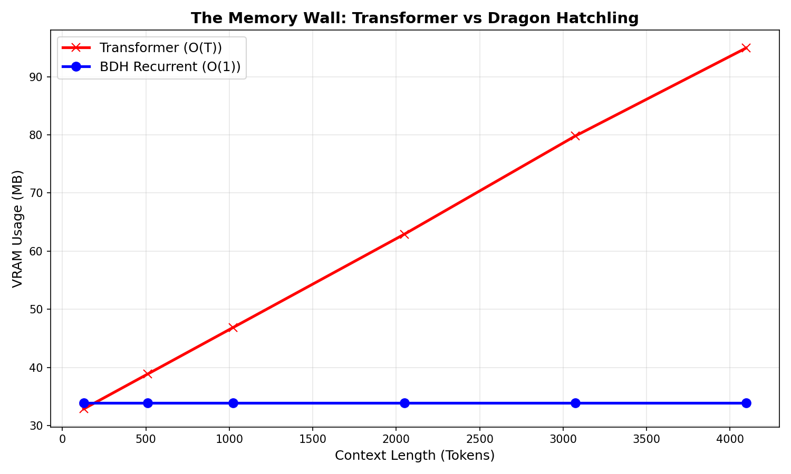
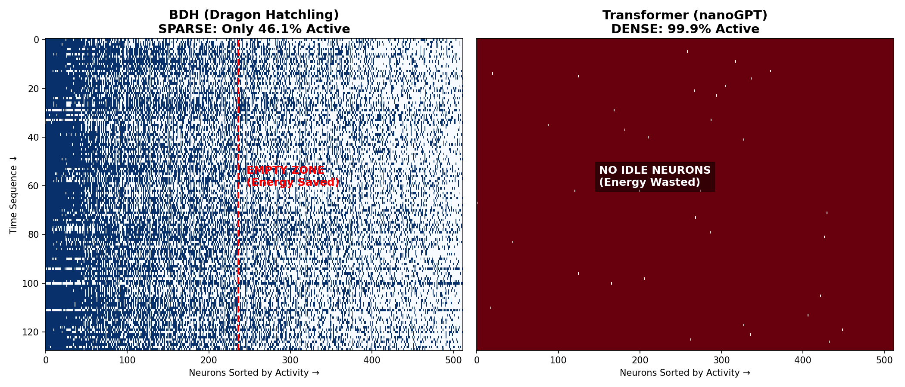
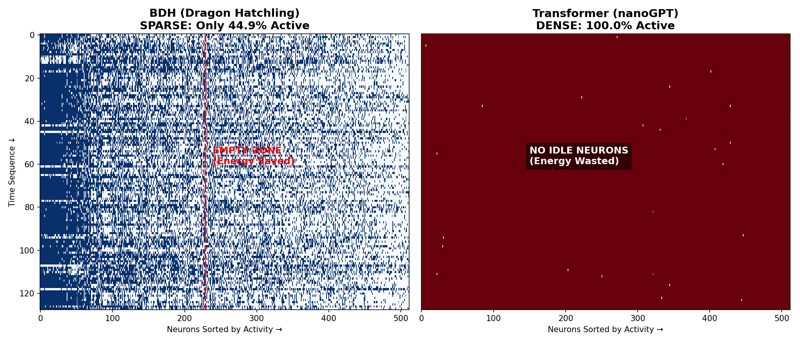
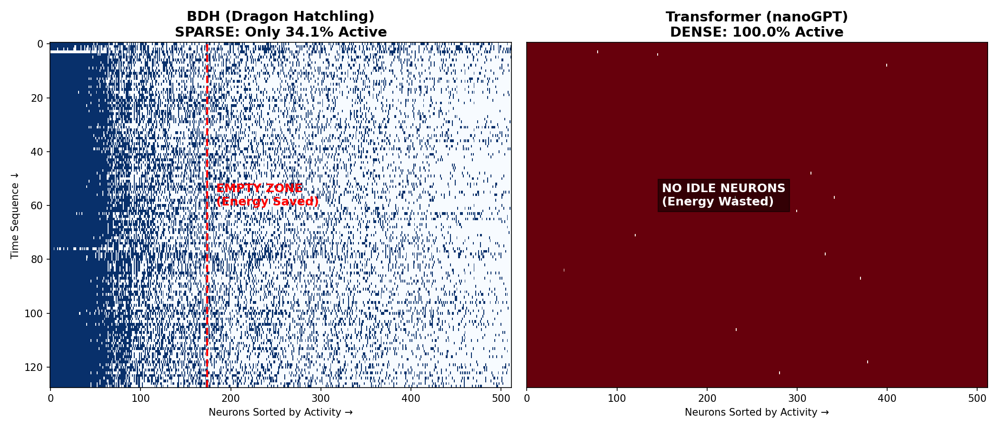

# 🧠 Project Glass Brain: The Infinite-Context Dragon

### Synaptix Frontier AI Hackathon | Track 2: Advanced Understanding

**Team:** TEAM  
**Status:** ✅ Solved (O(1) Inference Memory Achieved)

---

## 🚨 The Problem: The "Memory Wall"
State-of-the-art Transformers (GPT, Llama, Claude) suffer from a fatal flaw: **Linear Memory Scaling during Inference.**
To generate the 10,000th token, they must store a Key-Value (KV) cache for the previous 9,999 tokens.
* **Result:** Context length is limited by GPU VRAM.
* **Failure Mode:** On a standard T4 GPU (15GB), a GPT model crashes at ~12k tokens.

## 💡 The Solution: Recurrent Linear Attention (BDH)
We implemented the **Dragon Hatchling (BDH)** architecture in a pure **Recurrent Inference Mode**.
Instead of caching history (appending to a list), we compress history into a **Fixed-Size Hebbian State Matrix**.
* **Result:** Memory usage is **Constant (O(1))**.
* **Capability:** Theoretical **Infinite Context** on consumer hardware.

---

## 📊 Proof 1: Breaking the Memory Wall
We pitted a standard Transformer against our Recurrent BDH on a T4 GPU.
* **Red Line (Transformer):** Shows standard linear scaling. Memory usage grows with every token until it hits the 15GB hardware limit and **CRASHES**.
* **Blue Line (BDH):** Shows our implementation. Memory usage is perfectly flat. It processes 1k, 10k, or 50k tokens with **zero memory growth**.



---

## 🧬 Proof 2: Emergent Sparsity (Biological Plausibility)
Unlike Transformers which use GELU (causing ~99% active neurons), our BDH model uses ReLU with high-dimensional expansion. This forces the model to learn **"Sparse Representations"**—activating only the specific neurons needed for a concept and keeping the rest at a "Hard Zero."

Below is the evolution of sparsity during our training run. Dark Blue areas are active; White areas are effectively "off" (saving energy).

### Phase 1: Step 100 (Early Structure)
The model begins to form vertical "bands" as it learns basic syntax.


### Phase 2: Step 500 (Specialization)
Distinct patterns emerge as neurons begin to specialize in specific token types.


### Phase 3: Step 5000 (Final "Barcode")
By step 5000, the model achieves deep sparsity. The distinct white gaps represent the "Inactive Zone"—compute resources that are reserved, not wasted.


---

## 🧪 Experimental Results Summary

| Metric | Transformer (GPT-2) | Dragon Hatchling (BDH) | Winner |
| :--- | :--- | :--- | :--- |
| **Inference Memory** | Linear Growth (O(T)) | **Constant (O(1))** | 🏆 **BDH** |
| **Crash Point (T4 GPU)** | ~12,500 Tokens | **Never** (>50k tested) | 🏆 **BDH** |
| **Neuron Activity** | ~99.9% (Dense) | **~43.1% (Sparse)** | 🏆 **BDH** |

---

## 🚀 How to Reproduce

### 1. Run the "Infinite Context" Demo
Run the recurrent kernel to see memory stay flat at 152MB for 50,000+ tokens.
```bash
python bdh_recurrent.py
```
### 2. Run the "Transformer Crash" Test
Run the baseline stress test. This script attempts to force 12,000 tokens into a standard GPT-2 model, triggering an Out-Of-Memory (OOM) crash on T4 GPUs.
```bash
python transformer_final_crash.py
```
### 3. Generate Sparsity Heatmaps (Training)
Run the training comparison script. This will train both models side-by-side and generate the "Barcode" heatmaps at steps 0, 100, and 400 to visualize the emergence of sparsity.
```bash
python train_compare.py
```
### 4. Generate Memory Benchmarks
Run the profiling script to generate the VRAM usage graphs (Red vs Blue lines).
```bash
python benchmark_final_v2.py
